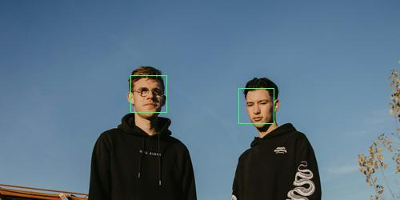
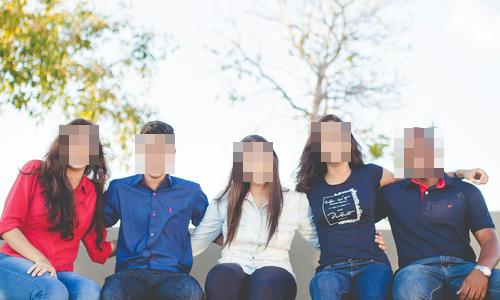
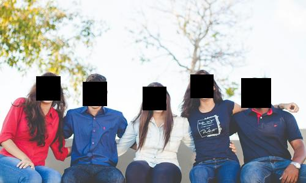
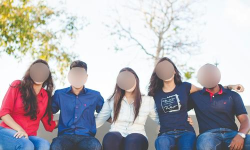

# imagorface

[](https://github.com/cshum/imagorface/actions/workflows/test.yml)
[](https://codecov.io/gh/cshum/imagorface)
[](https://hub.docker.com/r/shumc/imagorface/)

imagorface brings fast, on-the-fly face detection to [imagor](https://github.com/cshum/imagor). Built on [pigo](https://github.com/esimov/pigo) PICO cascade classifier to detect faces in an image. Detected face regions replace libvips attention heuristic as the smart crop anchor, producing face-centred crops.

- **Face-centred smart crop** — detected faces as the smart crop anchor, no more headless bodies
- **Privacy redaction** — blur, pixelate, or solid-fill detected faces for content moderation
- **Metadata API** — detected regions exposed through imagor `/meta` metadata endpoint for downstream use
- **Self-hosted** — no third-party API, no per-call cost, no data egress

imagorface implements the imagor [`Detector` interface](https://github.com/cshum/imagor/blob/master/detector.go), wiring into imagor [loader, storage and result storage](https://github.com/cshum/imagor#loader-storage-and-result-storage), supporting image [cropping, resizing](https://github.com/cshum/imagor#image-endpoint) and [filters](https://github.com/cshum/imagor#filters) out of the box.

### Quick Start

```bash
docker run -p 8000:8000 shumc/imagorface -imagor-unsafe -face-detector
```
Original Image:

```
https://raw.githubusercontent.com/cshum/imagorface/refs/heads/main/testdata/people.jpg
```


Try these URLs after starting the server:
```
http://localhost:8000/unsafe/500x250/smart/https://raw.githubusercontent.com/cshum/imagorface/refs/heads/main/testdata/people.jpg
http://localhost:8000/unsafe/500x250/smart/filters:draw_detections()/https://raw.githubusercontent.com/cshum/imagorface/refs/heads/main/testdata/people.jpg
http://localhost:8000/unsafe/500x250/smart/filters:redact()/https://raw.githubusercontent.com/cshum/imagorface/refs/heads/main/testdata/people.jpg
http://localhost:8000/unsafe/500x250/smart/filters:redact(pixelate)/https://raw.githubusercontent.com/cshum/imagorface/refs/heads/main/testdata/people.jpg
http://localhost:8000/unsafe/500x250/smart/filters:redact(black)/https://raw.githubusercontent.com/cshum/imagorface/refs/heads/main/testdata/people.jpg
http://localhost:8000/unsafe/500x250/smart/filters:redact_oval()/https://raw.githubusercontent.com/cshum/imagorface/refs/heads/main/testdata/people.jpg
```

| Smart crop (`500x250/smart`) | Draw detections (`draw_detections()`) |
|---|---|
|  |  |

| Redact blur (`redact()`) | Redact pixelate (`redact(pixelate)`) |
|---|---|
|  |  |

| Redact solid black (`redact(black)`) | Redact oval blur (`redact_oval()`) |
|---|---|
|  |  |

### Smart Crop

When `-face-detector` is enabled, imagorface runs face detection before the crop step. If one or more faces are found, their bounding boxes are used as the focal region for [imagor's smart crop](https://github.com/cshum/imagor#image-endpoint), replacing the default libvips attention-based heuristic. When no faces are found, imagor falls back to the standard attention crop.

Face detection runs on a downscaled greyscale probe derived from the raw decoded pixels, keeping overhead minimal relative to the subsequent libvips operations.

### Filters

imagorface enables the following filters in the imagor pipeline. See [imagor filters](https://github.com/cshum/imagor#filters) for the full filter reference.

- `draw_detections()` — draws colour-coded bounding boxes for all detected regions. Each class name is automatically assigned a distinct colour via hash-based palette for visual inspection.

```
http://localhost:8000/unsafe/500x250/smart/filters:draw_detections()/https://raw.githubusercontent.com/cshum/imagorface/refs/heads/main/testdata/people.jpg
```

- `redact([mode[, strength]])` obscures all detected regions for privacy/anonymisation (e.g. GDPR face blurring, legal document redaction). No-op when no regions are detected. Skips animated images.
  - `mode` — `blur` (default), `pixelate`, or any color name/hex for solid fill (e.g. `black`, `white`, `ff0000`)
  - `strength` — blur sigma (default 15) or pixelate block size in pixels (default 10). Not used for solid color mode.

```bash
# Blur detected faces (default)
http://localhost:8000/unsafe/500x250/smart/filters:redact()/https://raw.githubusercontent.com/cshum/imagorface/refs/heads/main/testdata/people.jpg

# Pixelate detected faces
http://localhost:8000/unsafe/500x250/smart/filters:redact(pixelate)/https://raw.githubusercontent.com/cshum/imagorface/refs/heads/main/testdata/people.jpg

# Blur with custom strength
http://localhost:8000/unsafe/500x250/smart/filters:redact(blur,25)/https://raw.githubusercontent.com/cshum/imagorface/refs/heads/main/testdata/people.jpg

# Solid black fill (most common for legal/compliance redaction)
http://localhost:8000/unsafe/500x250/smart/filters:redact(black)/https://raw.githubusercontent.com/cshum/imagorface/refs/heads/main/testdata/people.jpg

# Solid white fill
http://localhost:8000/unsafe/500x250/smart/filters:redact(white)/https://raw.githubusercontent.com/cshum/imagorface/refs/heads/main/testdata/people.jpg

# Custom color fill
http://localhost:8000/unsafe/500x250/smart/filters:redact(ff0000)/https://raw.githubusercontent.com/cshum/imagorface/refs/heads/main/testdata/people.jpg
```

- `redact_oval([mode[, strength]])` identical to `redact` but applies an **elliptical mask** to each region, producing a rounded/oval redaction shape. This is the most natural shape for face anonymisation as it closely follows the contour of a face. Same arguments and defaults as `redact`.

```bash
# Oval blur (most natural for faces)
http://localhost:8000/unsafe/500x250/smart/filters:redact_oval()/https://raw.githubusercontent.com/cshum/imagorface/refs/heads/main/testdata/people.jpg

# Oval pixelate
http://localhost:8000/unsafe/500x250/smart/filters:redact_oval(pixelate)/https://raw.githubusercontent.com/cshum/imagorface/refs/heads/main/testdata/people.jpg

# Oval solid black ellipse
http://localhost:8000/unsafe/500x250/smart/filters:redact_oval(black)/https://raw.githubusercontent.com/cshum/imagorface/refs/heads/main/testdata/people.jpg
```

### Metadata

imagorface exposes detected face regions through imagor's metadata endpoint. Each region is returned in absolute pixels relative to the output image dimensions, along with a detection score and label.

To use the metadata endpoint, add `/meta` right after the URL signature hash before the image operations. Detection only runs when the URL semantically requests it — `smart`, `draw_detections()`, or `redact()` to trigger detection:

```
# Runs detection, returns detected_regions
http://localhost:8000/unsafe/meta/500x250/smart/filters:draw_detections()/https://raw.githubusercontent.com/cshum/imagorface/refs/heads/main/testdata/people.jpg
http://localhost:8000/unsafe/meta/500x250/smart/https://raw.githubusercontent.com/cshum/imagorface/refs/heads/main/testdata/people.jpg
```

Response includes a `detected_regions` array:

```json
{
  "format": "jpeg",
  "content_type": "image/jpeg",
  "width": 800,
  "height": 600,
  "detected_regions": [
    { "left": 120, "top": 45, "right": 280, "bottom": 205, "score": 12.34, "name": "face" },
    { "left": 350, "top": 60, "right": 490, "bottom": 200, "score": 9.10, "name": "face" }
  ]
}
```

`score` is the raw pigo detection quality (higher is more confident). `name` is `"face"` for all regions returned by this detector.

### Face Detect Cache

imagorface maintains an in-memory cache of detection results, keyed by source image path. This avoids re-running the pigo cascade on the same source image across repeated requests — smart crop, `detections()`, and `redact()` all benefit. The cache is backed by [ristretto](https://github.com/dgraph-io/ristretto) with LRU eviction and a configurable entry count.

```dotenv
FACE_DETECTOR_CACHE_SIZE=500  # Max number of cached detection results. Default 0 = disabled
FACE_DETECTOR_CACHE_TTL=1h    # Cache entry TTL. Default 0 = no expiry (LRU eviction only)
```

**When to use:**
- Enable when the same source images are requested repeatedly (e.g. a product catalogue where the same images are cropped at multiple sizes). The first request runs pigo; all subsequent requests for the same path return the cached regions instantly.
- Set `FACE_DETECTOR_CACHE_TTL` if source images may change at the same path (e.g. mutable assets). Without a TTL, stale detection results are served until evicted by memory pressure or process restart.
- Leave disabled (default) if source image paths are highly varied or user-supplied, as caching provides no benefit.
- The `draw_detections()` filter always bypasses the cache (it passes an empty path) since it is not a hot path.

### Configuration

Configuration options specific to imagorface. Please see [imagor configuration](https://github.com/cshum/imagor#configuration) for all existing options available, including `-vips-detector-probe-size` which controls the maximum dimension of the downscaled probe image passed to any detector (default 400).

```
  -face-detector
        enable face detection for smart crop
  -face-detector-min-size int
        minimum face size in pixels on the probe image (default 20)
  -face-detector-max-size int
        maximum face size in pixels on the probe image (default 400)
  -face-detector-min-quality float
        minimum detection quality threshold; lower = more candidates, higher = fewer false positives (default 5.0)
  -face-detector-iou-threshold float
        intersection-over-union threshold for non-maxima suppression (default 0.2)
  -face-detector-cache-size int
        face detect cache size in number of entries (one per unique source image path). 0 = disabled (default)
  -face-detector-cache-ttl duration
        face detect cache TTL. 0 = no expiry (default)
```

Environment variable equivalents:
```dotenv
FACE_DETECTOR=1
FACE_DETECTOR_MIN_SIZE=20
FACE_DETECTOR_MAX_SIZE=400
FACE_DETECTOR_MIN_QUALITY=5.0
FACE_DETECTOR_IOU_THRESHOLD=0.2
FACE_DETECTOR_CACHE_SIZE=500
FACE_DETECTOR_CACHE_TTL=1h
```
